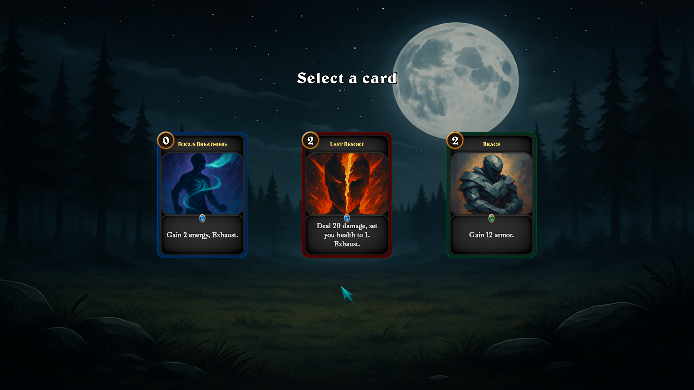
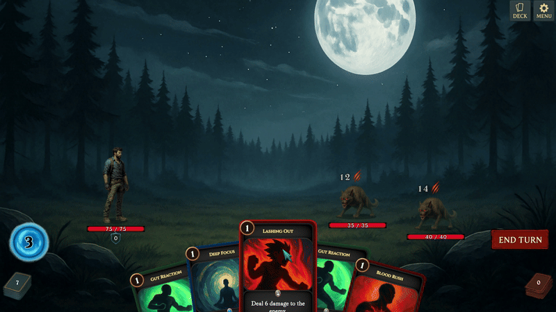

# Turn-Based Deckbuilder Prototype (Unity)

A playable Unity (C#) prototype focused on **gameplay systems**: turn flow, card UX (drag/drop targeting), enemy intent telegraphing, status effects, and a post-combat reward flow.

**Scope:** solo prototype built as a portfolio systems exercise (non-commercial).

---

## Quick links
- **Play (WebGL):** https://fouzis.itch.io/card-battler-unity-learning-clone-inspired-by-slay-the-spire
- **Download (Windows build):** https://github.com/DimitrisFuzi/UnityRoguelikeCardGame/releases/download/v0.1.0-learning-clone/CardBattler_LearningClone_v0.1.0_Windows.zip
- **Technical breakdown:** [Docs/TECH_BREAKDOWN.md](Docs/TECH_BREAKDOWN.md)

---

## Systems implemented
- Turn-based combat loop with input gating (`TurnManager`, `BattleManager`, `HandManager`)
- Card interaction: hover + drag/drop + target validation (`CardMovement`)
- Data-driven cards via ScriptableObjects (`Card`) with polymorphic effect lists (`EffectData`)
- Enemy AI behaviors via an interface (`IEnemyAI`) and intent previews (`EnemyIntent` → `EnemyDisplay`)
- Reward selection scene (card choices + deck add) (`RewardSceneController`, `RewardCardView`)

---

## 📸 Screenshots

### Combat

### Reward Screen

### Gameplay GIF

---

## ▶️ How to Play
- Hover a card to preview it
- Left-click & drag to play
- Click **End Turn** to finish your turn

---

## Run locally (Unity Editor)
- Unity version: **Unity 6** (Editor version used during development: `6000.2.0b7`)
- Open scenes:
  - `Assets/Scenes/BattleBoss1` (boss fight / intent variety)
  - `Assets/Scenes/Battle1` (battle that leads to reward scene)

> Note: card targeting is intended for fullscreen play. In windowed mode, targeting may behave unexpectedly.

---

## 🛠️ Tech Stack
- Unity 6 (C#)
- DOTween (UI animation)
- TextMeshPro
- GitHub

---

## ⚠️ Disclaimer
This is a **non-commercial** gameplay prototype. The combat structure is inspired by modern roguelike deckbuilders (e.g., *Slay the Spire*).  
All third‑party art/audio is used under its respective license and for educational/portfolio purposes.

---

## 👤 Credits
- Developed by **Dimitris Foutzitzakis**
- Gameplay systems & UI: self-developed
- Music & SFX: royalty-free assets (opengameart.org, pixabay.com, soundimage.org)
